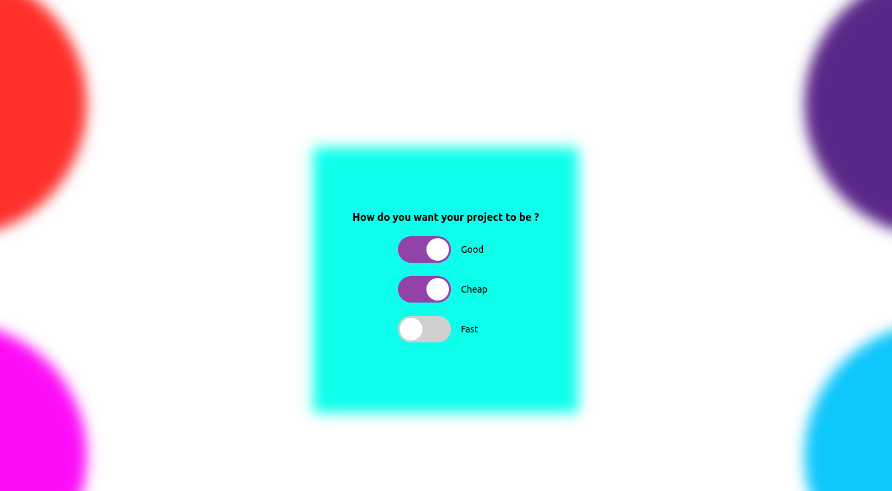

#  Mini Javascript Projects

###### The purpose of the mini-project is to allow you to explore the breadth of research that is being performed within the college. Thus, you may want to make it a goal of your mini-project to explore an discipline that is outside of your immediate research interest or area.

